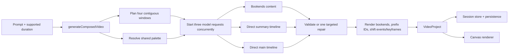

# VideoGPT architecture

## Generation flow

## Server boundary

`POST /api/generate` and `POST /api/generate/stream` accept `{ prompt, duration }` and both call `generateComposedVideo`. The JSON result is `{ project, projectName, summary }`; internal authored parts are not exposed by the root API. The streaming route emits `generating-sections`, then `composing`, then the completed response. There is no automatic outer retry and no modification route.

## Composer

`next/src/lib/agent/videoParts/composedVideo.ts` is the generation module. It plans intro, summary, main, and conclusion windows before any model call, resolves one deterministic palette, starts the three section requests with `Promise.allSettled`, and fails all-or-nothing with the rejected section named in the error.

Bookend lengths are 0.85, 1.05, 1.35, and 1.5 seconds for 5, 10, 15, and 20 second projects. Summary receives 30% of remaining content time clamped to 1–4 seconds. Main receives the remaining content time.

## Authorship contracts

- Bookends: `title`, optional `subtitle`, and `closingLine`.
- Summary: `mode: "direct-summary-timeline"`, `name`, `visualIntent`, and local `events`.
- Main: `mode: "direct-timeline"`, `name`, `visualIntent`, and local `events`.

The summary prompt requests a minimal high-level introduction. The main prompt requests one deeper mechanism and forbids a generic overview or repeated pipeline unless that structure is intrinsic to the subject.

## Validation and repair

`next/src/lib/agent/videoParts/directTimeline.ts` implements shared validation profiles. Schema parsing rejects unsupported event fields. Semantic validation checks budgets, IDs, local timing, full-duration backgrounds, canvas and path intersection, readable labels, shape counts, motion, and meaningful label collisions. Findings are returned unchanged to one targeted repair call along with the rejected JSON. Authored geometry is never silently moved or rewritten.

## Composition and rendering

Bookend text is turned into basic background, accent, and text events by `videoParts/project.ts`. Summary and main events pass through without layout expansion. Composition prefixes section IDs and adds the section offset to event times and absolute keyframe times; it does not rescale motion. The existing renderer remains a pure consumer of validated `TimelineEvent`s.

## Client and developer tools

The root store persists messages and `VideoProject`s only. Successful projects disable follow-up prompts and direct the user to create a new project. Hydration sanitizes obsolete fields from older sessions while keeping rendered projects viewable.

The `/dev` part pages continue to generate title, summary, main, and conclusion independently. The advanced inspector reports direct-timeline intent, event types, layers, and timing. `/dev/generate` is a part-generation hub; the incompatible style-gallery endpoint and legacy viewer are removed.

## Removed architecture

There is no semantic video brief, scene expansion, graph or scene layout, storyboard compiler, primitive diagnostics/retry pipeline, legacy response envelope, or modification pipeline in current generation. ADRs 0001–0011 remain only as historical records and are superseded by ADR 0012.
