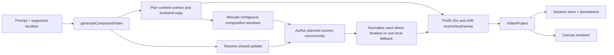

# VideoGPT architecture

## Generation flow

## Server boundary

`POST /api/generate` and `POST /api/generate/stream` accept `{ prompt, duration }` and both call `generateComposedVideo`. The JSON result is `{ project, projectName, summary }`; internal authored parts are not exposed by the root API. The streaming route emits `planning`, `generating-sections`, and `composing` before the completed response. There is no automatic outer retry and no modification route.

## Composer

`next/src/lib/agent/rootGeneration/composedVideo.ts` is the root generation module. It requests a topic-specific scene plan, allocates intro, scene, and conclusion windows, resolves one deterministic palette, then authors every planned scene concurrently with `Promise.allSettled`. A rejected scene fails the generation with that scene named in the error.

The planner chooses two to five overview, mechanism, example, or comparison scenes according to the duration. Deterministic intro and conclusion windows surround content windows sized from normalized scene shares.

## Authorship contracts

- Plan: `title`, optional `subtitle`, `closingLine`, `logline`, and ordered scene definitions.
- Overview scene: `mode: "direct-summary-timeline"`, `name`, `visualIntent`, and local `events`.
- Substantive scene: `mode: "direct-timeline"`, `name`, `visualIntent`, and local `events`.

Each scene prompt carries its role, goal, composition-window duration, palette context, and the other planned goals it must not repeat.

## Validation and repair

`next/src/lib/agent/rootGeneration/directTimeline.ts` implements root-owned normalization profiles. It preserves renderer-safe authored fields while repairing aliases, timing, geometry, and missing essentials. Event and output-token budgets scale to the scene's available duration. Invalid or malformed direct-timeline output becomes a deterministic local timeline after the initial request; it never triggers a second scene call. An invalid plan receives one targeted repair before deterministic plan fallback.

## Composition and rendering

Bookend text is turned into basic background, accent, and text events by `rootGeneration/project.ts`. Authored scene events pass through without layout expansion. Composition prefixes section IDs and adds each window offset to event times and absolute keyframe times; it does not rescale motion. The existing renderer remains a pure consumer of validated `TimelineEvent`s.

## Client and developer tools

The root store persists messages and `VideoProject`s only. Successful projects disable follow-up prompts and direct the user to create a new project. Hydration sanitizes obsolete fields from older sessions while keeping rendered projects viewable.

The `/dev` part pages continue to generate title, summary, main, and conclusion independently. The advanced inspector reports direct-timeline intent, event types, layers, and timing. `/dev/generate` is a part-generation hub; the incompatible style-gallery endpoint and legacy viewer are removed.

Root and dev generation deliberately own separate stacks. Root routes, scripts, planner, scene generation, composition, recovery, schemas, prompts, budgets, and transport live under `lib/agent/rootGeneration`. The dev API and pages retain the frozen reference stack under `lib/agent/videoParts`, including an independent transport. Neither generation namespace imports from the other; both converge only on platform schemas and the final renderer-facing `VideoProject` contract.

## Removed architecture

There is no semantic video brief, scene expansion, graph or scene layout, storyboard compiler, primitive diagnostics/retry pipeline, legacy response envelope, or modification pipeline in current generation. ADRs 0001–0011 remain only as historical records and are superseded by ADR 0012.
