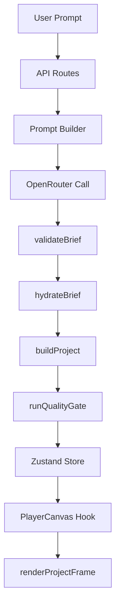

# VideoGPT Architecture and Pipeline Data Flow

This document details the pipeline of **VideoGPT**, tracing how a user prompt or modification instruction is processed, structured, validated, and animated on a canvas.

---

## 1. Pipeline Flow Diagram

This diagram maps the step-by-step lifecycle of a project request. Each node represents a distinct architectural boundary or processing function in the codebase.

---

## 2. Detailed Stage-by-Stage Explanation

### 1. User Prompt / Instructions

- **Description**: The user inputs a natural language prompt (e.g., _"compare client and server request flow"_) or types a chat instruction to modify an existing timeline.

### 2. API Routes

- **File/Symbol**: [next/src/app/api/generate/route.ts](next/src/app/api/generate/route.ts) & [next/src/app/api/modify/route.ts](next/src/app/api/modify/route.ts)
- **Description**: Serverless HTTP endpoint entry points. They accept POST payloads containing the prompt text, project duration, style preferences, and optional authorization headers.
- **State / Data Shape**: HTTP JSON Request body.

### 3. Prompt Builder

- **File/Symbol**: [next/src/lib/agent/ai/prompts.ts](next/src/lib/agent/ai/prompts.ts) (`buildSystemPrompt`, `buildModifyPrompt`)
- **Description**: Constructs structured system prompts directing the LLM to output valid JSON matching the target `VideoBrief` schema. If modifying, it injects the _current_ project state so the AI can compute incremental differences rather than rebuilding from scratch.
- **State / Data Shape**: Formatted LLM System & User prompt strings.

### 4. OpenRouter Call

- **File/Symbol**: [next/src/lib/agent/ai/openrouter.ts](next/src/lib/agent/ai/openrouter.ts) (`callOpenRouter`)
- **Description**: Sends the prompt context to OpenRouter (defaulting to the model specified in `.env.local`, e.g., `deepseek/deepseek-v4-flash`). Constraints are injected via prompts to force valid JSON back.
- **State / Data Shape**: A raw string representing a JSON object.

### 5. validateBrief

- **File/Symbol**: [next/src/lib/agent/brief/validateBrief.ts](next/src/lib/agent/brief/validateBrief.ts) (`validateBrief`)
- **Description**: The first layer of defense. It pre-processes the raw text returned by the LLM and runs a lenient Zod schema parsing. If the LLM misses enums, misspells keys, or drops arrays, Zod `.catch()` hooks dynamically inject safe fallback values.
- **State / Data Shape**: Hydrated and structured `VideoBrief` object.

### 6. hydrateBrief

- **File/Symbol**: [next/src/lib/agent/brief/buildProjectFromBrief.ts](next/src/lib/agent/brief/buildProjectFromBrief.ts) (`hydrateBrief`)
- **Description**: Takes the parsed brief and seeds a deterministic random number generator (`mulberry32`) using a hash of the project title. This is used to fill in any missing creative style parameters (e.g. particle densities, entry animations, column alignments). This guarantees different titles look unique, but the same title renders identically every time.
- **State / Data Shape**: Fully detailed `VideoBrief` object.

### 7. buildProject (Timeline Expander)

- **File/Symbol**: [next/src/lib/agent/brief/buildProjectFromBrief.ts](next/src/lib/agent/brief/buildProjectFromBrief.ts) (`buildProjectFromBrief`)
- **Description**: Translates the abstract `VideoBrief` properties (like lists of layout points, timing act weights, and gradients) into an array of concrete visual events (texts, rects, lines, particle systems) with absolute start and end times and coordinate positions.
- **State / Data Shape**: `VideoProject` object containing metadata and `TimelineEvent[]`.

### 8. runQualityGate

- **File/Symbol**: [next/src/lib/ui/renderer/validateProject.ts](next/src/lib/ui/renderer/validateProject.ts) (`runQualityGate`)
- **Description**: Performs visual checks on the compiled `VideoProject` timeline, checking for collision overlaps on the same layer, timing out-of-bounds, off-canvas coordinates, and text readability. Computes a numerical score from 0 to 100.
- **State / Data Shape**: `QualityResult` containing `passed`, `score`, and `QualityIssue[]`.

### 9. Zustand Store

- **File/Symbol**: [next/src/lib/ui/store.ts](next/src/lib/ui/store.ts) (`useStore`)
- **Description**: Updates the client store, adding the generated project, brief, and quality diagnostics to the chat message timeline. A store subscriber serializes a clean slice of the state to LocalStorage for offline persistence.
- **State / Data Shape**: Persisted React client state.

### 10. PlayerCanvas Hook

- **File/Symbol**: [next/src/components/canvas/PlayerCanvas.tsx](next/src/components/canvas/PlayerCanvas.tsx) (`PlayerCanvas`)
- **Description**: A React component rendering the HTML5 `<canvas>` element. Using a decoupled `useEffect` tracking changes to `currentTime` and `project`, it bypasses React virtual DOM updates and commands direct 2D context canvas draws. If drawing fails, it renders a visual error reporting grid inside the canvas instead of crashing.
- **State / Data Shape**: Canvas rendering context hook loop.

### 11. renderProjectFrame

- **File/Symbol**: [next/src/lib/ui/renderer/renderProjectFrame.ts](next/src/lib/ui/renderer/renderProjectFrame.ts) (`renderProjectFrame`)
- **Description**: The rendering engine. Filters and computes active visible timeline events for the current time. Computes easing positions and Catmull-Rom spline curves, updates particle positions, and draws shape fills, vectors, and texts directly onto the screen.
- **State / Data Shape**: Renders pixel frames to the screen.
