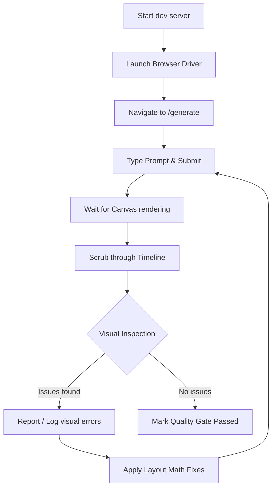

# Specification: Automated Visual Verification and Quality Loop

## 1. Overview
The goal is to build an automated workflow that runs the VideoGPT web application, inputs a generation prompt, waits for the video canvas to load, and scrubs the timeline frame-by-frame (or act-by-act) to inspect rendering details. If layout breaks, text clipping, layer collisions, or other design regressions are detected visually, they are reported so they can be iteratively corrected.

---

## 2. Target Flow & Architecture

The pipeline consists of a headless browser automation driver running in tandem with the Next.js dev server.



---

## 3. Key Components & Implementation Details

### A. Browser Automation Driver
- **Technology**: Playwright or Puppeteer.
- **Target Page**: `http://localhost:3000/generate`
- **Actions**:
  1. Wait for page load.
  2. Query selector for the input text field (`textarea` or `input`).
  3. Type the evaluation prompt (e.g. `"Client-Server Architecture"`).
  4. Click the generate button.
  5. Wait for the canvas element (`<canvas id="video-canvas">`) to be visible and initialized.

### B. Frame-by-Frame Scrubbing and Capture
- **Timeline Control**: The script needs to control the video playback timestamp.
- **Implementation**:
  - Locate the play/pause or timeline slider element.
  - Or, programmatically set the current timeline time by injecting a script into the browser context (e.g. updating the Zustand store or dispatching a timeline scrub event).
- **Capture**:
  - Take page/element screenshots at specified time-steps (e.g. every `0.5` seconds of the project duration).
  - Save screenshots as artifacts in `C:\Users\kiran\.gemini\antigravity-ide\brain\<conversation-id>\scratch\frames\`.

### C. Inspection and Diagnostic Feedback
- **Detection**:
  - Read project metadata from the frontend state (Zustand context or global window properties) to find the parsed `VideoProject` data structure.
  - Run `runQualityGate(project)` dynamically inside the browser or in the runner script using the extracted layout data.
  - Perform visual alignment checks on the captured screenshots.
- **Reporting**:
  - Output a report summarizing all frame-by-frame issues (colliding layers, off-screen coords, clipping).

---

## 4. Execution Command
The verification process will be executable via a simple command line script:
```bash
npm run test:visual
```
This runs `src/scripts/visualTestLoop.ts` which drives Playwright/Puppeteer and performs the verification sequence.
